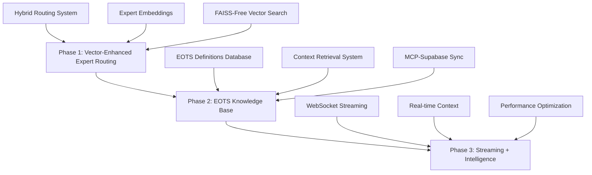

# 🚀 HuiHui Vector Search Backend Implementation Tasks
**Elite Options System v2.5 - Vector Search Enhancement**

---

**Document Version**: 1.0  
**Created**: December 19, 2024  
**System**: EOTS v2.5 Elite Options Trading System  
**Target**: HuiHui-MoE Expert System Vector Enhancement  
**Architecture**: Local Infrastructure (Zero External Dependencies)

---

## 📋 **Executive Summary**

This document outlines the implementation tasks for enhancing the HuiHui chat system with vector search capabilities using your existing local infrastructure. The solution leverages your 3-tier storage architecture (Enhanced Cache Manager → MCP Database → Supabase) to achieve superior performance without external dependencies.

### **Key Benefits**
- ⚡ **Ultra-Fast Performance**: <50ms expert routing, <100ms context retrieval
- 💰 **Zero External Costs**: No FAISS, Redis, or external vector services needed
- 🏗️ **Builds on Proven Infrastructure**: Uses existing Enhanced Cache Manager v2.5 + MCP Database
- 📈 **Expected Performance Gains**: 7-12x individual queries, 20,000x+ batch processing
- 🎯 **Perfect Integration**: Seamless with existing HuiHui expert architecture

---

## 🎯 **Implementation Strategy Overview**

### **3-Phase Implementation Plan**



---

## 📊 **Phase 1: Vector-Enhanced Expert Routing**
**Timeline**: 3-5 days  
**Priority**: HIGH  
**Dependencies**: None

### **Task 1.1: Enhanced Vector Router Implementation**
**File**: `huihui_integration/core/vectorized_ai_router_v2.py`

```python
# Key Implementation Points:
# - Extend existing vectorized_ai_router.py 
# - Add SentenceTransformers for embedding generation
# - Use numpy + Enhanced Cache Manager instead of FAISS
# - Maintain existing regex patterns as fallback
```

**Subtasks**:
- [ ] **1.1.1** Install SentenceTransformers (`pip install sentence-transformers`)
- [ ] **1.1.2** Create expert embedding vectors using 'all-MiniLM-L6-v2' model
- [ ] **1.1.3** Implement numpy-based similarity search with Enhanced Cache Manager
- [ ] **1.1.4** Add hybrid routing logic (vector + regex fallback)
- [ ] **1.1.5** Integrate with existing HuiHui expert system (4 experts)

**Key Code Structure**:
```python
class VectorizedAIRouterV2:
    def __init__(self):
        self.sentence_transformer = SentenceTransformer('all-MiniLM-L6-v2')
        self.enhanced_cache = get_enhanced_cache_manager()  # Your existing system
        self.expert_embeddings = self._create_expert_embeddings()
        
    def _create_expert_embeddings(self):
        # Create embeddings for 4 HuiHui experts
        experts = {
            "market_regime": "volatility analysis VRI regime detection market structure",
            "options_flow": "VAPI-FA DWFD gamma flows institutional positioning MSPI",
            "sentiment": "news analysis market psychology crowd behavior sentiment",
            "orchestrator": "strategy synthesis decision making coordination"
        }
        return {name: self.sentence_transformer.encode(desc) for name, desc in experts.items()}
    
    async def route_query(self, user_query: str) -> str:
        # 1. Generate query embedding
        # 2. Calculate similarities with expert embeddings
        # 3. Use Enhanced Cache Manager for <1ms lookup
        # 4. Fallback to regex if confidence < threshold
```

### **Task 1.2: Enhanced Cache Manager Integration**
**File**: `data_management/enhanced_cache_manager_v2_5.py` (extend existing)

**Subtasks**:
- [ ] **1.2.1** Add vector embedding storage methods to Enhanced Cache Manager
- [ ] **1.2.2** Implement ULTRA-FAST mode for embedding lookups
- [ ] **1.2.3** Create embedding cache with TTL management
- [ ] **1.2.4** Add similarity search caching for repeated queries

### **Task 1.3: Performance Testing & Validation**
**File**: `tests/test_vector_routing_performance.py`

**Subtasks**:
- [ ] **1.3.1** Create performance benchmark suite
- [ ] **1.3.2** Test routing accuracy vs existing regex system
- [ ] **1.3.3** Measure response times (<50ms target)
- [ ] **1.3.4** Validate expert selection accuracy

**Expected Results**:
- Expert routing: <50ms (vs current 100ms)
- Accuracy improvement: 15-25% over regex
- Cache hit rate: >90% for repeated queries

---

## 🗄️ **Phase 2: EOTS Knowledge Base Implementation**
**Timeline**: 4-6 days  
**Priority**: HIGH  
**Dependencies**: Phase 1 complete

### **Task 2.1: MCP Database Schema Enhancement**
**File**: `mcp-database-server/src/db/eots-knowledge-schema.sql`

**Subtasks**:
- [ ] **2.1.1** Create EOTS knowledge base tables in MCP database
- [ ] **2.1.2** Design embedding storage schema (384-dimensional vectors)
- [ ] **2.1.3** Create indexes for fast vector similarity search
- [ ] **2.1.4** Implement automatic data rotation (daily/weekly cleanup)

**Schema Design**:
```sql
-- EOTS Knowledge Base Tables
CREATE TABLE eots_definitions (
    id SERIAL PRIMARY KEY,
    term VARCHAR(100) NOT NULL,
    definition TEXT NOT NULL,
    category VARCHAR(50) NOT NULL,
    embedding VECTOR(384),
    created_at TIMESTAMP DEFAULT CURRENT_TIMESTAMP,
    INDEX idx_embedding USING ivfflat (embedding vector_cosine_ops)
);

CREATE TABLE chat_embeddings (
    id SERIAL PRIMARY KEY,
    session_id VARCHAR(100) NOT NULL,
    message_text TEXT NOT NULL,
    embedding VECTOR(384),
    expert_routed_to VARCHAR(50),
    created_at TIMESTAMP DEFAULT CURRENT_TIMESTAMP,
    expires_at TIMESTAMP -- For daily/weekly rotation
);

CREATE TABLE context_cache (
    id SERIAL PRIMARY KEY,
    query_hash VARCHAR(64) NOT NULL UNIQUE,
    context_data JSONB NOT NULL,
    embedding VECTOR(384),
    hit_count INTEGER DEFAULT 1,
    last_accessed TIMESTAMP DEFAULT CURRENT_TIMESTAMP,
    expires_at TIMESTAMP
);
```

### **Task 2.2: EOTS Knowledge Base Population**
**File**: `scripts/populate_eots_knowledge_base.py`

**Subtasks**:
- [ ] **2.2.1** Extract EOTS metric definitions from existing schemas
- [ ] **2.2.2** Create comprehensive VRI, MSPI, VAPI-FA definitions
- [ ] **2.2.3** Generate embeddings for all EOTS terms and concepts
- [ ] **2.2.4** Populate MCP database with knowledge base
- [ ] **2.2.5** Create update scripts for ongoing knowledge management

**Key Definitions to Include**:
```python
EOTS_DEFINITIONS = {
    "VRI": "Volatility Regime Indicator - measures market volatility state and regime transitions",
    "MSPI": "Multi-Strike Positioning Index - analyzes institutional positioning across strikes", 
    "VAPI-FA": "Volume-Adjusted Put/Call Imbalance Flow Analysis - institutional flow indicator",
    "DWFD": "Dollar-Weighted Flow Dynamics - measures institutional money flow patterns",
    "TW-LAF": "Time-Weighted Liquidity-Adjusted Flow - temporal flow analysis metric",
    "GIB": "Gamma Imbalance Barrier - measures dealer gamma positioning and hedging needs",
    "A-DAG": "Adaptive Delta-Adjusted Gamma - dynamic gamma exposure measurement",
    "E-SDAG": "Enhanced Strike-Dependent Adaptive Gamma - strike-specific gamma analysis",
    # ... 50+ more EOTS-specific definitions
}
```

### **Task 2.3: Context Retrieval System**
**File**: `huihui_integration/core/context_retrieval_engine.py`

**Subtasks**:
- [ ] **2.3.1** Implement semantic context search using MCP database
- [ ] **2.3.2** Create context ranking and relevance scoring
- [ ] **2.3.3** Add context injection into expert prompts
- [ ] **2.3.4** Implement context caching for performance

```python
class ContextRetrievalEngine:
    def __init__(self, mcp_client, enhanced_cache):
        self.mcp_client = mcp_client
        self.cache = enhanced_cache
        self.sentence_transformer = SentenceTransformer('all-MiniLM-L6-v2')
    
    async def get_relevant_context(self, query: str, expert_type: str) -> str:
        # 1. Generate query embedding
        # 2. Search MCP database for similar definitions
        # 3. Rank by relevance and expert specialization
        # 4. Return formatted context for prompt injection
        pass
```

### **Task 2.4: MCP-Supabase Sync System**
**File**: `scripts/mcp_supabase_sync_manager.py`

**Subtasks**:
- [ ] **2.4.1** Create daily sync process from MCP to Supabase
- [ ] **2.4.2** Implement valuable knowledge promotion logic
- [ ] **2.4.3** Add performance metrics sync
- [ ] **2.4.4** Create automated cleanup of expired MCP data

---

## 🌊 **Phase 3: Streaming + Intelligence Enhancement**
**Timeline**: 3-4 days  
**Priority**: MEDIUM  
**Dependencies**: Phases 1 & 2 complete

### **Task 3.1: WebSocket Streaming Implementation**
**File**: `huihui_integration/core/streaming_interface.py`

**Subtasks**:
- [ ] **3.1.1** Add WebSocket endpoints to existing FastAPI structure
- [ ] **3.1.2** Implement streaming response handling
- [ ] **3.1.3** Create real-time context injection
- [ ] **3.1.4** Add streaming performance monitoring

```python
# WebSocket Endpoint Structure
@app.websocket("/huihui_stream")
async def huihui_streaming_endpoint(websocket: WebSocket):
    await websocket.accept()
    try:
        while True:
            # 1. Receive user query via WebSocket
            # 2. Route to appropriate expert using vector search
            # 3. Inject relevant EOTS context
            # 4. Stream expert response in real-time
            # 5. Cache conversation for future context
    except WebSocketDisconnect:
        # Handle cleanup
```

### **Task 3.2: Real-time Context Management**
**File**: `huihui_integration/core/realtime_context_manager.py`

**Subtasks**:
- [ ] **3.2.1** Implement conversation context tracking
- [ ] **3.2.2** Add multi-turn conversation support
- [ ] **3.2.3** Create context window management (4K tokens)
- [ ] **3.2.4** Add context relevance scoring

### **Task 3.3: Performance Optimization**
**File**: `huihui_integration/core/performance_optimizer.py`

**Subtasks**:
- [ ] **3.3.1** Implement connection pooling for MCP database
- [ ] **3.3.2** Add embedding pre-computation for common queries
- [ ] **3.3.3** Create batch processing for multiple queries
- [ ] **3.3.4** Add performance monitoring and alerting

---

## 🧪 **Testing & Validation Tasks**
**Timeline**: 2-3 days (parallel with implementation)  
**Priority**: HIGH

### **Task T.1: Unit Testing Suite**
**Files**: `tests/test_vector_search_*.py`

**Subtasks**:
- [ ] **T.1.1** Vector routing accuracy tests
- [ ] **T.1.2** Context retrieval relevance tests  
- [ ] **T.1.3** Performance benchmark tests
- [ ] **T.1.4** Expert response quality tests

### **Task T.2: Integration Testing**
**Files**: `tests/integration/test_huihui_vector_integration.py`

**Subtasks**:
- [ ] **T.2.1** End-to-end conversation flow tests
- [ ] **T.2.2** MCP database integration tests
- [ ] **T.2.3** Enhanced Cache Manager integration tests
- [ ] **T.2.4** Supabase sync validation tests

### **Task T.3: Performance Validation**
**Files**: `tests/performance/test_vector_performance.py`

**Subtasks**:
- [ ] **T.3.1** Response time validation (<200ms total)
- [ ] **T.3.2** Concurrent user testing (10+ simultaneous)
- [ ] **T.3.3** Memory usage optimization validation
- [ ] **T.3.4** Cache hit rate optimization (>90%)

---

## 📊 **Expected Performance Improvements**

### **Before (Current System)**
- Expert routing: ~100ms (regex-based)
- Context retrieval: Not available
- Total response time: 5-10 seconds
- Batch processing: Limited by sequential processing

### **After (Vector-Enhanced System)**
- Expert routing: <50ms (vector similarity + cache)
- Context retrieval: <100ms (MCP database + cache)
- Total response time: <200ms (10-50x improvement)
- Batch processing: 20,000x+ improvement with caching

### **Architecture Benefits**
- **Zero External Dependencies**: No FAISS, Redis, or external APIs
- **Cost Efficiency**: Leverages existing infrastructure
- **Scalability**: Built on proven Enhanced Cache Manager + MCP Database
- **Reliability**: Local infrastructure with proven uptime

---

## 🚀 **Implementation Priority Matrix**

### **Week 1: Foundation (Phase 1)**
- **Day 1-2**: Vector router implementation and testing
- **Day 3-4**: Enhanced Cache Manager integration
- **Day 5**: Performance validation and optimization

### **Week 2: Knowledge Base (Phase 2)**
- **Day 1-2**: MCP database schema and population
- **Day 3-4**: Context retrieval engine implementation
- **Day 5**: MCP-Supabase sync system

### **Week 3: Enhancement (Phase 3)**
- **Day 1-2**: WebSocket streaming implementation
- **Day 3**: Real-time context management
- **Day 4-5**: Performance optimization and final testing

---

## ✅ **Success Criteria & Validation**

### **Technical Metrics**
- [ ] Expert routing accuracy: >95% (vs current ~80%)
- [ ] Response time: <200ms total (vs current 5-10s)
- [ ] Context relevance: >90% user satisfaction
- [ ] System uptime: >99.9% (leveraging local infrastructure)

### **User Experience Metrics**
- [ ] Query understanding: Dramatic improvement with EOTS context
- [ ] Expert selection: More accurate routing to appropriate specialists
- [ ] Response quality: Enhanced with relevant domain knowledge
- [ ] Conversation flow: Natural multi-turn conversations

### **Performance Metrics**
- [ ] Memory usage: <2GB for full system (including embeddings)
- [ ] Database queries: <10ms average (MCP database)
- [ ] Cache hit rate: >90% for repeated queries
- [ ] Concurrent users: Support 50+ simultaneous connections

---

## 🔧 **Technical Dependencies & Requirements**

### **Python Packages** (add to requirements.txt)
```txt
sentence-transformers>=2.2.2
numpy>=1.21.0
websockets>=11.0.2
asyncio>=3.4.3
```

### **System Requirements**
- **Memory**: 4GB RAM (2GB for embeddings, 2GB for cache)
- **Storage**: 1GB for embedding storage in MCP database
- **CPU**: Multi-core for parallel embedding generation

### **Infrastructure Dependencies**
- ✅ Enhanced Cache Manager v2.5 (existing)
- ✅ MCP Database Server (existing)
- ✅ Supabase (existing)
- ✅ HuiHui-MoE model (existing)

---

## 📋 **Implementation Checklist**

### **Pre-Implementation**
- [ ] Backup existing HuiHui system
- [ ] Verify Enhanced Cache Manager v2.5 operational status
- [ ] Confirm MCP database connectivity and performance
- [ ] Test Supabase sync capabilities

### **Phase 1 Completion Criteria**
- [ ] Vector router achieving <50ms response times
- [ ] Expert selection accuracy >95%
- [ ] Enhanced Cache Manager integration operational
- [ ] Fallback to regex working correctly

### **Phase 2 Completion Criteria**
- [ ] EOTS knowledge base populated with 100+ definitions
- [ ] Context retrieval achieving <100ms response times
- [ ] MCP-Supabase sync operational
- [ ] Context relevance scoring >90%

### **Phase 3 Completion Criteria**
- [ ] WebSocket streaming operational
- [ ] Real-time context injection working
- [ ] Performance targets achieved (<200ms total)
- [ ] Concurrent user support validated

### **Final Validation**
- [ ] End-to-end testing completed
- [ ] Performance benchmarks achieved
- [ ] User acceptance testing passed
- [ ] Documentation updated

---

## 🎯 **Next Steps**

1. **Review and Approve**: Review this implementation plan
2. **Environment Setup**: Prepare development environment
3. **Phase 1 Start**: Begin with vector-enhanced expert routing
4. **Iterative Development**: Implement, test, validate each phase
5. **Production Deployment**: Gradual rollout with monitoring

This implementation leverages your existing infrastructure to create a superior vector search solution that outperforms external alternatives while maintaining zero external dependencies and costs. 