# 🧠 **HuiHui Integration Directory Structure Map**
**EOTS v2.5 - Comprehensive Directory Reference**

---

**Document Version**: 2.5.1  
**Updated**: 2025-06-23  
**System**: EOTS v2.5 Elite Options Trading System  
**Purpose**: Complete reference for HuiHui integration directory structure and component purposes

---

## 📋 **Overview**

The HuiHui integration system is organized into a comprehensive directory structure that supports the 4-expert AI system with dedicated spaces for development, learning, monitoring, and coordination. This document provides a complete map of all directories, files, and their specific purposes within the EOTS v2.5 framework.

---

## 🗂️ **Directory Structure Mermaid Diagram**

```mermaid
graph TD
    A[huihui_integration/] --> B[core/]
    A --> C[experts/]
    A --> D[orchestrator_bridge/]
    A --> E[monitoring/]
    A --> F[learning/]
    A --> G[databases/]
    A --> H[config/]
    
    %% Core Directory
    B --> B1[model_interface.py]
    B --> B2[ai_model_router.py]
    B --> B3[local_llm_client.py]
    
    %% Experts Directory
    C --> C1[market_regime/]
    C --> C2[options_flow/]
    C --> C3[sentiment/]
    
    %% Market Regime Expert
    C1 --> C1A[__init__.py]
    C1 --> C1B[expert.py]
    C1 --> C1C[database.py]
    C1 --> C1D[learning.py]
    C1 --> C1E[prompts.py]
    
    %% Options Flow Expert
    C2 --> C2A[__init__.py]
    C2 --> C2B[expert.py]
    C2 --> C2C[database.py]
    C2 --> C2D[learning.py]
    C2 --> C2E[prompts.py]
    
    %% Sentiment Expert
    C3 --> C3A[__init__.py]
    C3 --> C3B[expert.py]
    C3 --> C3C[database.py]
    C3 --> C3D[learning.py]
    C3 --> C3E[prompts.py]
    
    %% Orchestrator Bridge
    D --> D1[expert_coordinator.py]
    D --> D2[its_integration.py]
    
    %% Monitoring
    E --> E1[usage_monitor.py]
    E --> E2[supabase_manager.py]
    E --> E3[safety_manager.py]
    E --> E4[security_manager.py]
    
    %% Learning
    F --> F1[feedback_loops.py]
    F --> F2[performance_tracking.py]
    F --> F3[knowledge_sharing.py]
    
    %% Databases
    G --> G1[market_regime_db.py]
    G --> G2[options_flow_db.py]
    G --> G3[sentiment_db.py]
    G --> G4[shared_knowledge_db.py]
    
    %% Config
    H --> H1[expert_configs.py]
    H --> H2[system_settings.py]
    
    %% External Integration
    I[core_analytics_engine/] --> I1[its_orchestrator_v2_5.py]
    D2 -.-> I1
    
    %% Styling
    classDef coreClass fill:#e1f5fe,stroke:#01579b,stroke-width:2px
    classDef expertClass fill:#f3e5f5,stroke:#4a148c,stroke-width:2px
    classDef bridgeClass fill:#fff3e0,stroke:#e65100,stroke-width:2px
    classDef monitorClass fill:#e8f5e8,stroke:#1b5e20,stroke-width:2px
    classDef learningClass fill:#fff8e1,stroke:#f57f17,stroke-width:2px
    classDef dbClass fill:#fce4ec,stroke:#880e4f,stroke-width:2px
    classDef configClass fill:#f1f8e9,stroke:#33691e,stroke-width:2px
    classDef externalClass fill:#ffebee,stroke:#b71c1c,stroke-width:2px
    
    class B,B1,B2,B3 coreClass
    class C,C1,C2,C3,C1A,C1B,C1C,C1D,C1E,C2A,C2B,C2C,C2D,C2E,C3A,C3B,C3C,C3D,C3E expertClass
    class D,D1,D2 bridgeClass
    class E,E1,E2,E3,E4 monitorClass
    class F,F1,F2,F3 learningClass
    class G,G1,G2,G3,G4 dbClass
    class H,H1,H2 configClass
    class I,I1 externalClass
```



---

## 📁 **Detailed Directory Breakdown**

### **🔧 Core Directory (`core/`)**
**Purpose**: Central AI model interfaces and routing logic

#### **Files & Purposes**:
- **`model_interface.py`**: 
  - Pydantic AI model implementations for all 4 HuiHui experts
  - Model initialization, configuration, and request handling
  - Expert-specific model creation functions
  - Integration with EOTS schemas and validation

- **`ai_model_router.py`**: 
  - Intelligent routing system for selecting appropriate experts
  - Query analysis and expert recommendation
  - Load balancing and performance optimization
  - Fallback mechanisms and error handling

- **`local_llm_client.py`**: 
  - Direct communication interface with HuiHui-MoE model
  - Request formatting and response parsing
  - Connection management and retry logic
  - Authentication and security handling

---

### **🧠 Experts Directory (`experts/`)**
**Purpose**: Individual expert implementations with dedicated development spaces

#### **Market Regime Expert (`market_regime/`)**
**Specialization**: Volatility analysis, regime detection, market structure assessment

- **`__init__.py`**: Expert configuration, metadata, and initialization
- **`expert.py`**: Core expert implementation and analysis logic (future)
- **`database.py`**: Dedicated database operations for regime data (future)
- **`learning.py`**: Specialized learning algorithms for regime prediction (future)
- **`prompts.py`**: Optimized prompts for regime analysis (future)

#### **Options Flow Expert (`options_flow/`)**
**Specialization**: VAPI-FA, DWFD, institutional flow analysis, gamma dynamics

- **`__init__.py`**: Expert configuration, metadata, and initialization
- **`expert.py`**: Core expert implementation and flow analysis logic (future)
- **`database.py`**: Dedicated database operations for flow data (future)
- **`learning.py`**: Specialized learning algorithms for flow prediction (future)
- **`prompts.py`**: Optimized prompts for flow analysis (future)

#### **Sentiment Expert (`sentiment/`)**
**Specialization**: News analysis, market psychology, crowd behavior assessment

- **`__init__.py`**: Expert configuration, metadata, and initialization
- **`expert.py`**: Core expert implementation and sentiment analysis logic (future)
- **`database.py`**: Dedicated database operations for sentiment data (future)
- **`learning.py`**: Specialized learning algorithms for sentiment prediction (future)
- **`prompts.py`**: Optimized prompts for sentiment analysis (future)

---

### **🎯 Orchestrator Bridge (`orchestrator_bridge/`)**
**Purpose**: Coordination between 3 specialists and Meta-Orchestrator integration

#### **Files & Purposes**:
- **`expert_coordinator.py`**: 
  - Coordinates analysis between the 3 specialist experts
  - Manages expert communication and data sharing
  - Handles conflict resolution and consensus building
  - Performance monitoring and expert weighting

- **`its_integration.py`**: 
  - Bridge to `its_orchestrator_v2_5.py` in core analytics engine
  - Data format conversion and integration protocols
  - Seamless handoff between specialists and Meta-Orchestrator
  - Maintains separation of concerns while enabling collaboration

---

### **📊 Monitoring Directory (`monitoring/`)**
**Purpose**: Performance tracking, safety systems, and operational monitoring

#### **Files & Purposes**:
- **`usage_monitor.py`**: 
  - Supabase-based usage tracking and analytics
  - Expert performance metrics and statistics
  - Resource utilization monitoring
  - Cost tracking and optimization insights

- **`supabase_manager.py`**: 
  - Database connection management for Supabase
  - Query optimization and connection pooling
  - Data synchronization and backup operations
  - Schema management and migrations

- **`safety_manager.py`**: 
  - Timeout management and request safety
  - Rate limiting and abuse prevention
  - Error handling and graceful degradation
  - System health monitoring and alerts

- **`security_manager.py`**: 
  - Authentication and authorization management
  - API key security and rotation
  - Input validation and sanitization
  - Audit logging and security monitoring

---

### **🎓 Learning Directory (`learning/`)**
**Purpose**: Advanced learning algorithms and cross-expert knowledge sharing

#### **Files & Purposes**:
- **`feedback_loops.py`**: 
  - Cross-expert learning and knowledge transfer
  - Feedback collection and processing
  - Performance improvement algorithms
  - Adaptive system evolution

- **`performance_tracking.py`**: 
  - Individual expert performance monitoring
  - Accuracy tracking and trend analysis
  - Benchmarking and comparative analysis
  - Performance optimization recommendations

- **`knowledge_sharing.py`**: 
  - Inter-expert knowledge transfer protocols
  - Shared learning pattern recognition
  - Collaborative intelligence development
  - Knowledge base maintenance and updates

---

### **🗄️ Databases Directory (`databases/`)**
**Purpose**: Individual expert databases and shared knowledge storage (future implementation)

#### **Files & Purposes**:
- **`market_regime_db.py`**: 
  - Market regime pattern storage and retrieval
  - Historical regime data management
  - Regime transition tracking
  - Volatility pattern database

- **`options_flow_db.py`**: 
  - Options flow pattern storage and analysis
  - Institutional behavior tracking
  - Gamma event database
  - Flow correlation analysis

- **`sentiment_db.py`**: 
  - Sentiment pattern storage and retrieval
  - News impact tracking
  - Social sentiment database
  - Behavioral pattern analysis

- **`shared_knowledge_db.py`**: 
  - Cross-expert knowledge base
  - Shared learning patterns
  - Collaborative insights storage
  - System-wide intelligence repository

---

### **⚙️ Config Directory (`config/`)**
**Purpose**: Expert configurations and system-wide settings

#### **Files & Purposes**:
- **`expert_configs.py`**: 
  - Individual expert configuration management
  - Temperature, token limits, and prompt settings
  - Expert-specific optimization parameters
  - Performance tuning configurations

- **`system_settings.py`**: 
  - System-wide HuiHui configuration
  - Global performance settings
  - Integration parameters
  - Security and monitoring configurations

---

## 🔗 **External Integration Points**

### **Core Analytics Engine Integration**
- **`core_analytics_engine/its_orchestrator_v2_5.py`**: 
  - Meta-Orchestrator implementation (4th expert)
  - Final strategic synthesis and decision making
  - ATIF framework integration
  - Complete EOTS system coordination

### **Data Flow Architecture**
```
EOTS Data → [3 Specialists] → [Expert Coordinator] → [Meta-Orchestrator] → ATIF → Trading Decisions
```

---

## 📈 **Development Status**

### **✅ Currently Implemented**
- Core model interfaces and routing
- Expert configuration and metadata
- Basic monitoring and safety systems
- Orchestrator bridge architecture
- Configuration management

### **🔄 In Development**
- Individual expert implementations
- Dedicated database systems
- Advanced learning algorithms
- Performance optimization
- Cross-expert communication

### **🎯 Future Enhancements**
- Expert-specific fine-tuning
- Advanced learning models
- Real-time performance monitoring
- Dynamic configuration optimization
- Extended expert specializations

---

**Document Version**: 2.5.1  
**Last Updated**: 2025-06-23  
**Maintained By**: EOTS v2.5 AI Intelligence Division  
**Next Review**: 2025-07-23
