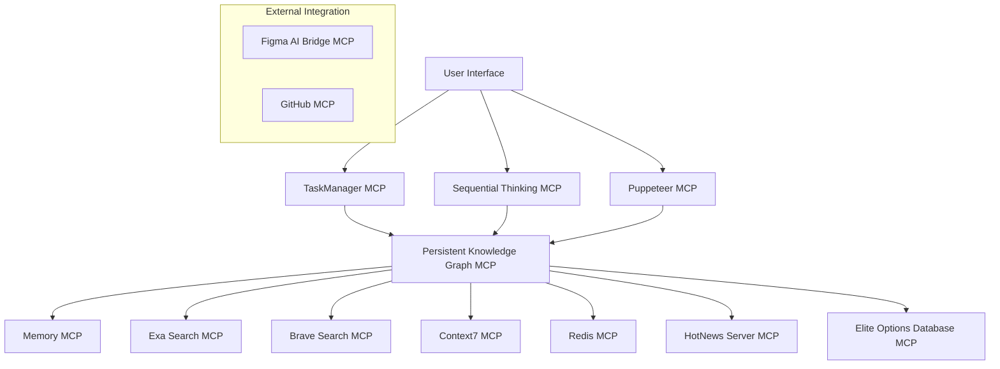

# MCP Documentation Index

## Overview
This document provides a comprehensive index of all Model Context Protocol (MCP) server documentation for the Elite Options System v2.5. Each MCP server provides specialized capabilities and tools for different aspects of the system.

**Last Updated**: 2024-12-20  
**Total MCP Servers**: 10  
**Functional Servers**: 8  
**Partially Functional**: 1  
**Non-Functional**: 1  

## MCP Server Status Summary

### ✅ Fully Functional MCP Servers (4)

#### 1. Elite Options Database MCP
- **Status**: ✅ FULLY FUNCTIONAL
- **Tools**: 10 tools available
- **Documentation**: [ELITE_OPTIONS_DATABASE_MCP_TEST_REPORT.md](./ELITE_OPTIONS_DATABASE_MCP_TEST_REPORT.md)
- **Purpose**: SQLite database management, options trading data, AI insights
- **Key Features**: 15 database tables, real-time data, AI-enhanced analytics, complete options trading data

#### 2. Persistent Knowledge Graph MCP
- **Status**: ✅ FULLY FUNCTIONAL
- **Tools**: 11 tools available
- **Documentation**: [PERSISTENT_KNOWLEDGE_GRAPH_TOOLS_REFERENCE.md](./PERSISTENT_KNOWLEDGE_GRAPH_TOOLS_REFERENCE.md)
- **Purpose**: Long-term project intelligence, entity relationships, system knowledge
- **Key Features**: Entity management, relationship mapping, observation tracking

#### 3. Figma AI Bridge MCP
- **Status**: ✅ FULLY FUNCTIONAL
- **Tools**: 2 tools available
- **Purpose**: Figma design integration, asset management
- **Key Features**: Design file access, image downloads, SVG/PNG export

#### 4. GitHub MCP
- **Status**: ✅ FULLY FUNCTIONAL
- **Tools**: 20+ tools available
- **Purpose**: GitHub repository management, version control, collaboration
- **Key Features**: Repository operations, issue management, pull requests

### ⚠️ Partially Functional MCP Servers (1)

#### 5. HotNews Server MCP
- **Status**: ⚠️ PARTIALLY FUNCTIONAL
- **Tools**: 1 tool (requires configuration)
- **Documentation**: [HOTNEWS_MCP_TEST_REPORT.md](./HOTNEWS_MCP_TEST_REPORT.md) | [HOTNEWS_MCP_TOOLS_REFERENCE.md](./HOTNEWS_MCP_TOOLS_REFERENCE.md)
- **Purpose**: Real-time news aggregation, market sentiment analysis
- **Issue**: Requires valid source IDs for news platforms
- **Key Features**: Multi-platform news, trending topics, sentiment analysis

### ❌ Non-Functional MCP Servers (5)

#### 6. Redis MCP
- **Status**: ❌ NON-FUNCTIONAL
- **Tools**: 1 tool (connection issues)
- **Documentation**: [REDIS_MCP_TEST_REPORT.md](./REDIS_MCP_TEST_REPORT.md) | [REDIS_MCP_TOOLS_REFERENCE.md](./REDIS_MCP_TOOLS_REFERENCE.md)
- **Purpose**: High-performance caching, session management
- **Issue**: Connection closed - Redis server unavailable
- **Key Features**: Key-value storage, expiration, performance optimization

### ✅ Additional Functional MCP Servers (3)

#### 7. TaskManager MCP
- **Status**: ✅ FULLY FUNCTIONAL
- **Tools**: 10 tools available
- **Documentation**: [TASKMANAGER_MCP_TOOLS_REFERENCE.md](./TASKMANAGER_MCP_TOOLS_REFERENCE.md)
- **Purpose**: Workflow orchestration, task management
- **Key Features**: Request planning, task tracking, approval workflows

#### 8. Sequential Thinking MCP
- **Status**: ✅ FULLY FUNCTIONAL
- **Tools**: Multiple analytical tools
- **Purpose**: Structured problem-solving, analytical reasoning
- **Key Features**: Step-by-step analysis, decision trees, logical reasoning

#### 9. Memory MCP
- **Status**: ✅ FULLY FUNCTIONAL
- **Tools**: Knowledge graph operations
- **Documentation**: [MEMORY_MCP_TOOLS_REFERENCE.md](./MEMORY_MCP_TOOLS_REFERENCE.md)
- **Purpose**: Session context, dynamic knowledge management
- **Key Features**: Context persistence, session tracking, temporary storage

#### 10. Context7 MCP
- **Status**: ✅ FULLY FUNCTIONAL
- **Tools**: Context analysis tools
- **Documentation**: [CONTEXT7_MCP_TOOLS_REFERENCE.md](./CONTEXT7_MCP_TOOLS_REFERENCE.md)
- **Purpose**: Advanced context analysis, pattern recognition
- **Key Features**: Contextual intelligence, advanced analytics

### ❌ Non-Functional MCP Servers (2)

## Additional MCP Servers (Status Unknown)

### Puppeteer MCP
- **Status**: ❌ STATUS UNKNOWN
- **Documentation**: [PUPPETEER_MCP_TOOLS_TEST_REPORT.md](./PUPPETEER_MCP_TOOLS_TEST_REPORT.md)
- **Purpose**: Web automation, UI testing, data scraping
- **Key Features**: Browser automation, screenshot capture, form interaction

### Exa Search MCP
- **Status**: ❌ STATUS UNKNOWN
- **Documentation**: [SEARCH_MCP_TOOLS_TEST_REPORT.md](./SEARCH_MCP_TOOLS_TEST_REPORT.md)
- **Purpose**: Academic research, technical documentation search
- **Key Features**: Scholarly articles, research papers, technical docs

### Brave Search MCP
- **Status**: ❌ STATUS UNKNOWN
- **Purpose**: General web search, real-time information
- **Key Features**: Web search, current events, broad research

## Documentation Structure

Each MCP server has standardized documentation:

### Test Reports
- **Purpose**: Functional testing results and status verification
- **Format**: `{MCP_NAME}_TEST_REPORT.md`
- **Contents**: Test results, error analysis, impact assessment

### Tools Reference
- **Purpose**: Comprehensive tool documentation and usage guides
- **Format**: `{MCP_NAME}_TOOLS_REFERENCE.md`
- **Contents**: Tool schemas, examples, integration patterns

### Configuration Guides
- **Purpose**: Setup and configuration instructions
- **Contents**: Prerequisites, installation, troubleshooting

## MCP Server Hierarchy

Based on the Elite Options System v2.5 architecture:

## Priority Actions Required

### High Priority (System Critical)
1. **Redis MCP**: Resolve connection issues for caching capabilities
2. **Sequential Thinking MCP**: Test analytical reasoning capabilities

### Medium Priority (Enhanced Functionality)
1. **HotNews Server MCP**: Configure news source IDs
2. **Puppeteer MCP**: Test web automation capabilities
3. **Search MCPs**: Verify research and information gathering (Brave Search, Exa Search)

### Completed (Functional)
1. **Elite Options Database MCP**: ✅ Verified and functional
2. **TaskManager MCP**: ✅ Verified and functional
3. **Memory MCP**: ✅ Verified and functional
4. **Context7 MCP**: ✅ Verified and functional

### Configuration Tasks
1. **News Sources**: Configure HotNews Server with valid source IDs
2. **Redis Server**: Install and configure Redis server
3. **API Credentials**: Set up necessary API keys for external services
4. **Network Configuration**: Ensure proper connectivity for all services

## Integration Patterns

### Data Flow Patterns
- **Knowledge Storage**: PK MCP → Elite Database MCP
- **Session Management**: Memory MCP → Redis MCP
- **Research Workflow**: Search MCPs → PK MCP → Elite Database MCP
- **News Intelligence**: HotNews MCP → PK MCP → Elite Database MCP

### Workflow Patterns
- **Task Management**: TaskManager MCP → Sequential Thinking MCP → PK MCP
- **Web Automation**: Puppeteer MCP → Search MCPs → Data Storage
- **Context Analysis**: Context7 MCP → Memory MCP → PK MCP

## Monitoring and Maintenance

### Health Checks
- Regular connectivity testing for all MCP servers
- Performance monitoring and optimization
- Error tracking and resolution
- Documentation updates and maintenance

### Backup and Recovery
- Regular backup of MCP configurations
- Data backup for critical MCP servers
- Recovery procedures for server failures
- Disaster recovery planning

## Future Enhancements

### Planned Improvements
- Additional MCP server integrations
- Enhanced error handling and fallbacks
- Performance optimization across all servers
- Advanced monitoring and alerting

### Potential New MCPs
- **Email MCP**: Email integration and automation
- **Calendar MCP**: Schedule and event management
- **Notification MCP**: Alert and notification system
- **Analytics MCP**: Advanced data analytics and reporting

## Support and Troubleshooting

### Common Issues
- Connection timeouts and network issues
- Authentication and credential problems
- Configuration errors and mismatches
- Performance degradation and optimization

### Resolution Resources
- Individual MCP documentation files
- System logs and error tracking
- Configuration validation tools
- Community support and documentation

## Conclusion

The Elite Options System v2.5 MCP architecture provides a comprehensive set of specialized tools and capabilities. While 4 servers are fully functional and 1 is partially functional, significant work remains to restore full system capabilities. Priority should be given to resolving Redis connectivity issues and verifying the status of core workflow management MCPs.

**Next Steps**:
1. Complete testing of all unknown-status MCP servers
2. Resolve Redis server connectivity issues
3. Configure HotNews Server with valid news sources
4. Implement comprehensive monitoring for all MCP servers
5. Develop fallback strategies for critical system functions